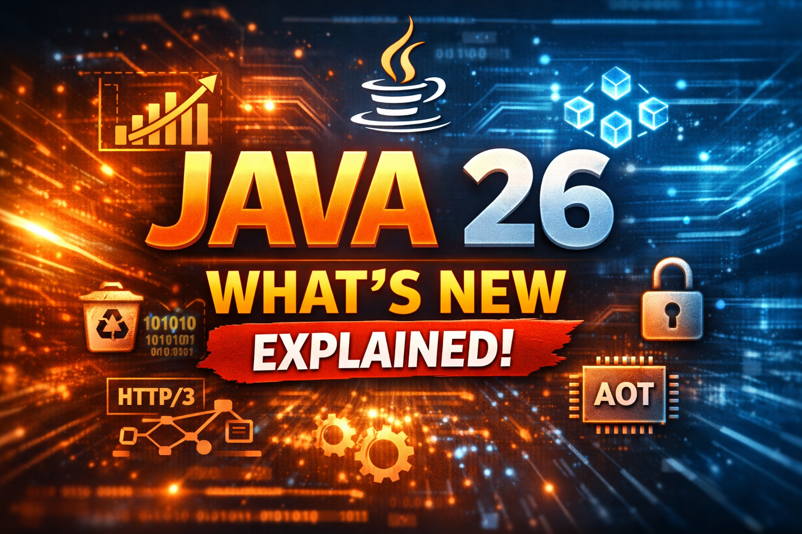

# JDK 26: What Actually Matters and Why You Should Care

*A practical breakdown of Java 26's most impactful features — no fluff, just what changes how you write code*

---

JDK 26 dropped on **March 17, 2026**, and it's one of the most well-rounded releases in recent memory. Not because of a single headline feature, but because it delivers improvements across **performance, language design, networking, and security** — all in one release.

Let's cut through the noise and focus on what actually matters.

---

## The Free Performance Wins

### G1 Garbage Collector: 75% Less Overhead

The G1 collector — Java's default GC since JDK 9 — gets a major internal redesign. The bookmarking mechanism has been reworked, cutting GC overhead by **75%**.

What makes this special? **You don't change a single line of code.** Just upgrade your JDK and your application gets faster. Every Java application running on G1 benefits — microservices, monoliths, batch jobs, AI pipelines. This is the kind of improvement that makes your infrastructure team smile at the next capacity planning meeting.

### AOT Object Caching with Any Garbage Collector

Cold starts have been a persistent pain point for Java — especially in serverless and containerized environments where every startup millisecond costs money.

AOT (Ahead-of-Time) object caching addresses the warmup problem by pre-caching objects that can be loaded immediately at startup. And unlike previous AOT efforts, this works with **any garbage collector**, not just a specific one.

If you're deploying Spring Boot apps in Kubernetes, running on AWS Lambda, or managing auto-scaling microservices, this feature directly impacts your startup latency and cost.

---

## HTTP/3: No More Third-Party Libraries

Java's `HttpClient` API (introduced in JDK 11) now natively supports **HTTP/3**.

If the server supports HTTP/3, Java uses it. If not, it gracefully falls back to HTTP/2. This is transparent — you don't need to change your `HttpClient` code.

Why does this matter?

- **HTTP/3 runs over QUIC** (UDP-based), which eliminates head-of-line blocking and improves connection establishment time
- **No more third-party dependencies** — no Netty plugins, no Jetty HTTP/3 modules. It's in the standard library
- **AI applications benefit directly** — if you're making high-frequency API calls to LLM providers, lower latency per request adds up fast

One less dependency to manage. One less thing to keep updated.

---

## JEP 500: When Final Actually Means Final

This is the most consequential language change in JDK 26 — and it's worth understanding deeply.

### The Problem

Until now, marking a field `final` was a **compiler-time check only**. At runtime, reflection could freely mutate final fields. And many popular frameworks depended on this:

- **Mockito** — injects mock values into final fields
- **Hibernate** — manages entity state through reflection
- **Spring** — field injection via `@Autowired` on final fields
- **Jackson** — deserializes JSON into objects with final fields

In other words, `final` was a suggestion, not a guarantee.

### What Changes in JDK 26

JDK 26 starts emitting **warnings** when final fields are mutated through reflection. The fields can still be changed — for now. But this is an explicit signal: **future JDK versions will make this an error.**

### Why This Matters Beyond Style

This isn't just about code correctness. Making final truly final is a **prerequisite for Project Valhalla**.

Valhalla's **Value Classes** — types with no identity that are purely defined by their field values — cannot be safely optimized by the JVM if it can't trust that fields are genuinely immutable. If reflection can mutate a "final" field, the JVM can't flatten value types, inline them, or eliminate identity checks.

**Action item**: Start auditing your codebase and dependencies for final field mutation via reflection. The warning phase is your migration window.

---

## Primitive Types in Patterns, instanceof, and switch (Preview)

Pattern matching has been evolving across multiple JDK releases, but it had a gap: **it only worked with objects**.

JDK 26 closes that gap. You can now pattern match on primitive types with automatic range checking and casting:

```java
int statusCode = getResponseCode();

String category = switch (statusCode) {
    case int code when code >= 200 && code < 300 -> "Success";
    case int code when code >= 400 && code < 500 -> "Client Error";
    case int code when code >= 500 -> "Server Error";
    default -> "Unknown";
};
```

And with `instanceof`:

```java
long value = getValue();
if (value instanceof int narrowed) {
    // Safe: JVM verified the value fits in int range
    processAsInt(narrowed);
}
```

The JVM handles range checking and safe narrowing for you. No manual bounds checking. No silent truncation bugs.

---

## Lazy Constants (Preview)

This is a subtle but genuinely useful addition.

### The Old Dilemma

In Java, you've always had two options:
1. **`final`** — must assign the value at declaration or in the constructor
2. **Non-final** — can assign later, but it's mutable forever

What if you want to assign a value **later** (because it depends on runtime context), but once assigned, it should be **immutable**?

### The New Option

Lazy constants give you exactly that. A field that starts unset, gets assigned once at runtime, and becomes effectively final from that point forward.

Think of configuration values resolved at startup, expensive computations deferred until first access, or dependency-injected values that shouldn't change after initialization. This pattern has been implemented manually with `volatile` + double-checked locking for years. Now the language handles it correctly and efficiently.

---

## PEM Encodings of Cryptographic Objects (Preview)

If you've ever parsed PEM files in Java, you know it involves more boilerplate than it should — reading files, stripping headers, Base64 decoding, feeding bytes into `KeyFactory` or `CertificateFactory`.

JDK 26 adds **first-class PEM support** in the standard library, making certificate and key parsing straightforward.

This is a quality-of-life improvement for anyone dealing with TLS certificates, mTLS between microservices, or API key management — which is essentially every production Java application.

---

## Vector API (Still Incubating — and Here's Why)

The Vector API has been incubating since **JDK 16**. That's 10 releases. So why isn't it final?

It's waiting on **Value Types from Project Valhalla**.

The Vector API lets you write Java code that maps directly to **CPU SIMD instructions** — the same kind of hardware-level parallelism that makes NumPy fast for numerical computation. When it finalizes, Java will have a native path to high-performance vector math without JNI or native libraries.

For AI workloads — embedding computations, similarity searches, matrix operations — this will be significant. But it needs Value Types to deliver the performance guarantees it promises. JEP 500 (final means final) is one step toward that future.

---

## Structured Concurrency (Preview)

Still in preview, but increasingly essential for modern Java patterns.

Structured concurrency binds child tasks to a parent scope. If the parent is cancelled, children are automatically cancelled. If a child fails, siblings can be shut down cleanly.

```java
try (var scope = new StructuredTaskScope.ShutdownOnFailure()) {
    var embeddingTask = scope.fork(() -> generateEmbedding(query));
    var searchTask = scope.fork(() -> searchVectorStore(query));

    scope.join().throwIfFailed();

    return buildResponse(embeddingTask.get(), searchTask.get());
}
```

This is the right way to orchestrate parallel AI calls — fan out to multiple models or services, collect results, and handle failure gracefully. No dangling threads. No orphaned tasks.

---

## Remove the Applet API

The Applet API is finally gone. Deprecated since JDK 9, marked for removal in JDK 17, and now actually removed.

End of an era. No action needed unless you're somehow still running applets in 2026 — in which case, we should talk.

---

## The Bigger Picture

JDK 26 isn't a flashy release with one marquee feature. It's a **mature, well-rounded release** that improves the platform across every dimension:

| Category | Feature | Impact |
|---|---|---|
| **Performance** | G1 GC redesign | 75% less overhead, zero code changes |
| **Startup** | AOT object caching | Faster cold starts for containers/serverless |
| **Networking** | HTTP/3 | Native support, no third-party libs |
| **Language** | Final means final (JEP 500) | Correctness + Valhalla foundation |
| **Language** | Primitive pattern matching | Cleaner, safer type narrowing |
| **Language** | Lazy constants | Deferred immutability |
| **Security** | PEM encodings | Simpler certificate handling |
| **Compute** | Vector API | SIMD instructions (awaiting Valhalla) |
| **Concurrency** | Structured concurrency | Safe parallel task orchestration |

The theme is clear: **Java is getting faster, safer, and more expressive** — without breaking the stability that enterprises depend on.

---

## What You Should Do Now

**Keep production on JDK 25 LTS.** JDK 26 is a non-LTS release — it won't receive long-term updates. JDK 25 remains the right choice for production stability and vendor support.

But that doesn't mean you should ignore JDK 26. Here's the smart approach:

1. **Set up a test environment on JDK 26** — Run your application and benchmark the G1 GC improvements. Measure the throughput gains. If the numbers are significant, that's your business case for upgrading when JDK 27 or the next LTS lands.
2. **Check your final field mutation warnings** — This is the most important action. Run your test suite on JDK 26 and look at the console warnings from JEP 500. How many final fields are being mutated via reflection? Which libraries are responsible — Mockito, Spring, Hibernate, Jackson? This tells you exactly how much work lies ahead before future JDKs make this an error.
3. **Audit your dependencies** — Some frameworks will need updates to comply with stricter final enforcement. Knowing which ones gives you lead time to plan upgrades or find alternatives.
4. **Watch Project Valhalla** — JEP 500 is a prerequisite. Value Types and the Vector API finalization are getting closer with each release.

---

*Have you tested your app on JDK 26 yet? How many final field mutation warnings did you find? I'd love to hear which libraries are causing the most noise — drop your findings in the comments.*

*Follow me for weekly deep dives into Java, Spring, and enterprise engineering.*
