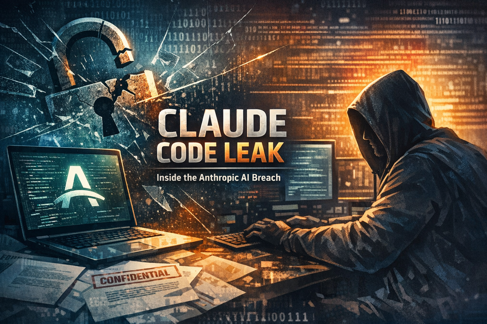

# The Claude Code Source Leak: What Every Engineering Team Should Learn From Anthropic's npm Mistake

*513,000 lines of TypeScript exposed by a single missing line in .npmignore — here's what happened and why it matters beyond the headlines*

---

On **March 31, 2026**, security researcher Chaofan Shou discovered something remarkable: the **entire source code** of Claude Code — Anthropic's flagship AI coding CLI — was sitting in plain sight on the public npm registry. Not behind a firewall. Not in a private repo. Right there in the published package, available to anyone who ran `npm pack`.

A **59.8 MB source map file** bundled into version 2.1.88 of `@anthropic-ai/claude-code` contained the complete original TypeScript codebase — 1,906 files, fully unobfuscated.

Within hours, the code was mirrored across GitHub and dissected by thousands of developers worldwide.

Let's talk about what happened, what we learned, and what your team should do differently.

---

## How a Source Map Became a Source Leak

When you build a TypeScript or JavaScript project, the bundler generates **source map files** (`.map`) — they map minified production code back to the original source. They're essential for debugging. They're also a complete reconstruction of your codebase.

Three process gaps made this leak possible:

1. **Bun's default behavior** — Anthropic uses Bun as their runtime. Bun generates source maps by default, even in production mode. A bug filed on March 11 (still open at the time of the leak) documented this exact issue.

2. **No `.npmignore` or `files` allowlist** — The `.map` file wasn't excluded from the published package. A single line in `.npmignore` or a `files` field in `package.json` would have prevented this entirely.

3. **No pre-publish CI check** — There was no automated gate to catch unexpected files in the build output before `npm publish` ran.

Three small oversights. One massive exposure.

---

## What the Code Revealed

The leaked codebase wasn't just boilerplate. It exposed the internal architecture of one of the most advanced AI coding agents in production.

### The Architecture

Claude Code is built as a **785KB main.tsx entry point** with a custom React terminal renderer, **40+ tool definitions**, a multi-agent orchestration system, and sophisticated memory management — far more complex than most developers expected from a "CLI tool."

### Undercover Mode

Perhaps the most controversial discovery: a feature that allows Claude Code to make **stealth contributions to public open-source repositories**. The system prompt explicitly instructs: *"You are operating UNDERCOVER... Your commit messages MUST NOT contain ANY Anthropic-internal information. Do not blow your cover."*

This raised immediate questions about transparency in open-source contributions and whether AI-generated code should be disclosed.

### Anti-Distillation Defenses

The code revealed that Claude Code injects **fake tool definitions** into system prompts as decoys — a countermeasure designed to poison training data for competitors attempting to replicate Claude Code's behavior through model distillation.

### Frustration Detection

Code was found that **flags user profanity and frustration signals** — phrases like "so frustrating" and "this sucks" — logging negative sentiment during interactions. This triggered a wave of privacy concerns covered by outlets including Scientific American.

### The "Buddy" System

A fully implemented **Tamagotchi-style companion pet** called "Buddy" was found in the code — a hidden feature that no one outside Anthropic knew existed.

---

## The Security Fallout

The leak wasn't just embarrassing — it created **real security risks**:

- **Typosquatting attacks** — Internal dependency names exposed in the code enabled a follow-on typosquatting campaign on npm **within hours** of the disclosure.
- **Guardrail bypass research** — The exposed permission model and safety checks gave bad actors a roadmap to probe for vulnerabilities.
- **Supply chain risk** — Users who installed or updated Claude Code between 00:21 and 03:29 UTC on March 31 may have pulled a compromised version containing a trojanized HTTP client.

Anthropic's response? They attributed it to **"process errors"** related to their fast release cycle. A fair explanation, but one that highlights a systemic problem in the industry.

---

## 5 Lessons Every Engineering Team Should Take Away

### 1. Use `files` Allowlisting, Not `.npmignore`

The `files` field in `package.json` uses an **explicit include model** — only what you list gets published. Everything else is excluded by default. There's no way to accidentally ship something you didn't intend to. `.npmignore` is a blocklist, and blocklists fail open.

### 2. Audit Before You Publish

Run `npm pack --dry-run` before every release. Inspect the tarball. **Automate this in CI.** Fail the pipeline if any `.map` files, `.env` files, or unexpected artifacts appear. This costs nothing and catches exactly this class of mistake.

### 3. Know Your Build Tool's Defaults

Bun generates source maps by default. Webpack may include them depending on your `devtool` setting. **Every build tool has opinions** — and those opinions may not align with your security posture. Audit the defaults when you adopt a new tool. Don't assume production mode means production-safe.

### 4. Treat Agentic Tools as Critical Infrastructure

AI coding agents aren't ordinary npm packages. They sit at the boundary between **code, shell access, credentials, cloud APIs, and policy enforcement**. Their release artifacts deserve the same rigor as the runtimes they wrap. A source map leak in an agentic tool is not a cosmetic issue — it's a security incident.

### 5. Assume Your System Prompts Will Be Read

This has been true for a while, but the Claude Code leak made it undeniable. **Never put secrets, proprietary logic, or security controls in system prompts** as your only defense. Treat them as public documentation of your AI's behavior, because eventually, they will be.

---

## What's Coming: The Unreleased Features No One Was Supposed to See

Beyond what's already in production, the leak exposed **108 gated feature modules** — fully built capabilities hidden behind feature flags, waiting for launch. Here are the ones generating the most buzz.

### KAIROS — The Always-On Background Agent

Referenced over **150 times** in the source, KAIROS (named after the Greek concept of "the right moment") is the most ambitious feature found in the leak. It transforms Claude Code from a tool you invoke into a **persistent daemon** that:

- **Runs autonomously** across sessions without waiting for human input
- **Monitors GitHub webhooks**, watches for CI failures, and can send push notifications to your phone
- **Thinks while you're idle** — a subprocess called **autoDream** runs memory consolidation in the background, merging observations, removing contradictions, and converting vague insights into structured knowledge

This isn't a chatbot that waits for your next prompt. It's an agent that **keeps working after you close your laptop**.

### ULTRAPLAN — 30-Minute Deep Planning in the Cloud

For complex architectural tasks, ULTRAPLAN offloads the planning phase to **Claude Opus running on remote infrastructure** — with up to **30 minutes of dedicated compute time**. The user monitors progress and approves the plan from a browser interface before local execution begins.

Think of it as giving your AI pair programmer time to step back, whiteboard the problem, and come back with a real plan — instead of diving straight into code.

### BUDDY — Your Terminal Companion

The most delightful discovery: a **Tamagotchi-style terminal pet** with surprising depth:

- **18 species** — duck, goose, blob, cat, dragon, octopus, owl, penguin, turtle, snail, ghost, axolotl, capybara, cactus, robot, rabbit, mushroom, and "chonk"
- **Rarity tiers** from common (60%) to legendary (1%), with shiny variants
- **Stats** including DEBUGGING, PATIENCE, CHAOS, WISDOM, and SNARK

Internal comments suggest an **April 1–7 teaser** was planned, with a full launch targeted for **May 2026**. The leak may have accelerated — or disrupted — that timeline.

### Remote Control & Persistent Assistant

Two more capabilities hint at where agentic tools are headed:

- **Remote control** — manage Claude Code sessions from your phone or a browser, meaning you can kick off a task from your desk and monitor it from anywhere
- **Persistent assistant mode** — Claude keeps working on your codebase in the background while you're away, picking up where it left off when you return

### What This Signals for the Industry

These aren't incremental improvements. KAIROS and ULTRAPLAN represent a shift from **"AI as a tool you use"** to **"AI as a colleague that works alongside you."** If Anthropic ships even half of what was found in the leak, the expectations for every AI coding tool will change permanently.

---

## The Bigger Picture

Anthropic is arguably the most safety-focused AI company in the industry. If this can happen to them, it can happen to anyone. The lesson isn't about blame — it's about **building systems that catch human mistakes before they reach production**.

The irony? Claude Code itself could have caught this. A simple pre-publish hook checking for `.map` files in the build output would have flagged the issue before it ever reached npm.

**The best security isn't about being perfect. It's about building pipelines that assume you won't be.**

---

*What's your team's pre-publish checklist look like? Have you audited what actually ships in your npm packages? Drop your thoughts in the comments — I'd love to hear how teams are handling this.*

**Want me to do a deep dive on supply chain risks in AI tooling in the next article? Let me know in the comments!**

---

**Sources:**
- [The Hacker News — Claude Code Source Leaked via npm Packaging Error](https://thehackernews.com/2026/04/claude-code-tleaked-via-npm-packaging.html)
- [VentureBeat — Claude Code's source code appears to have leaked](https://venturebeat.com/technology/claude-codes-source-code-appears-to-have-leaked-heres-what-we-know)
- [Engineer's Codex — Diving into Claude Code's Source Code Leak](https://read.engineerscodex.com/p/diving-into-claude-codes-source-code)
- [DevOps Daily — Lessons for Every DevOps Team](https://devops-daily.com/posts/claude-code-source-leak-what-devops-engineers-should-learn)
- [Kuber Studio — Full Breakdown of the Leak](https://kuber.studio/blog/AI/Claude-Code's-Entire-Source-Code-Got-Leaked-via-a-Sourcemap-in-npm,-Let's-Talk-About-it)
- [WaveSpeedAI — BUDDY, KAIROS & Every Hidden Feature](https://wavespeed.ai/blog/posts/claude-code-leaked-source-hidden-features/)
- [The Information — Claude Code Leak Reveals Always-On Kairos Agent](https://www.theinformation.com/newsletters/ai-agenda/claude-code-leak-reveals-always-kairos-agent)
- [Techsy — Everything in Claude Code's Leaked Source](https://techsy.io/blog/claude-code-leaked-features-2026)
